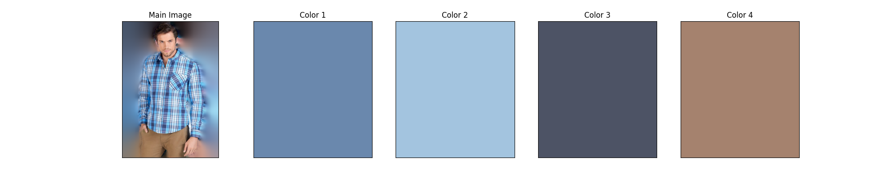

<h1>Table of Content</h1>
<ul>
<li><a href="#Objective">Objective</a></li>
<li><a href="#DataUnderstanding">Data Understading</a></li>
<li><a href="#DataPreparation">Data Preparation</a></li>
<li><a href="#Modelling">Modelling</a></li>
<li><a href="#Evaluation">Evaluation</a></li>
<li><a href="#Deployment">Deployment</a></li>
<li><a href="#Executive">Executive Summary</a></li>
</ul>

<h1>Business Understanding</h1>
<h2>Importance</h2>

Implementing an accurate and sophisticated image-based recommender system is crucial for ecommerce platforms. This system offers numerous benefits that can significantly enhance the online shopping experience.

<h2>Benefits</h2>

Enhances Customer Experience: Provides users with relevant and personalized product recommendations, increasing their satisfaction and loyalty.

Boosts Sales: Increases conversion rates by showcasing similar products, encouraging users to make purchases.

Improves Customer Satisfaction: Fulfils customers' desires for convenient and efficient shopping, reducing frustration and abandonment.

<h2>Unique Value Proposition</h2>

Our image-based recommender system offers a unique and innovative way for users to discover products. Key features include:

<ul style="list-style-type: disc;">
<li>Upload Inspirational Images: Users can share photos from social media, magazines, or real-life encounters to find similar products.</li>
<li>Discover Similar Products: Receive tailored recommendations for identical or similar garments.</li>
<li>Streamline Shopping: Effortlessly find desired products without tedious searching.</li>
</ul>
<h2>Key Benefits</h2>

Increased Engagement: Users interact more with the platform, exploring recommended products and increasing the chances of conversion.

Competitive Advantage: Differentiates the ecommerce site from competitors, establishing a unique selling proposition.

Valuable Data Insights: Generates data on user preferences, informing product development and marketing strategies to drive business growth.

<h2>Real-World Applications</h2>

Social Media Integration: Users can upload images from social media platforms, expanding the reach and potential for discovery.

Influencer Marketing: Partnerships with influencers can utilize their content to drive sales and increase brand awareness.

Offline-to-Online Shopping: Customers can upload images of products seen in physical stores, bridging the gap between offline and online shopping experiences.

<h1>2. Data Sources</h1>

To ensure the efficacy of the image-based search engine, a sizable dataset of diverse product images is required for training and testing purposes.

<h2>Primary Data Source</h2>

The primary source of images will be the ecommerce platform's existing product catalogue, which is expected to provide a comprehensive collection of product images.

<h2>Secondary Data Sources</h2>

If necessary, additional images will be collected through:

<ul style="list-style-type: disc;">
<li>
Web scraping methods: Relevant external websites will be scraped to collect product images, ensuring that the dataset remains diverse and comprehensive.
</li>
<li>
Data augmentation techniques: New images will be created by modifying existing ones using techniques such as rotation, flipping, and colour adjustment. This will help increase the size of the dataset while maintaining diversity.
</li>
</ul>
<h2>Data Quality Considerations</h2>

To ensure the quality of the dataset, the following considerations will be taken into account:

Image resolution: Images should be of sufficient resolution to enable accurate image classification and colour analysis.

Image diversity: The dataset should include a diverse range of products, colours, and styles to ensure that the system can generalise well.

Image labelling: Images should be accurately labelled with relevant metadata, such as product category, colour, and style.

<h1>3. Data Preparation</h1>

To prepare the data for the image-based search engine, multiple techniques were applied to ensure the quality and accuracy of the dataset.

<h2>Background Removal</h2>

Background removal was necessary to eliminate noise that interfered with the identification of primary colours in the images. This technique helped prevent erroneous recommendations.

<h2>Skin Detection and Removal</h2>

When images featured prominent skin tones, these tones were incorrectly used as part of the colour recommendation. To address this issue, an algorithm was implemented to detect and remove faces from images, reducing the impact of skin colour on the recommendations. While this technique did not remove other skin areas, such as arms and hands, it sufficed to meet the requirements.

<h2>Image Size and Quality</h2>

The chosen image size was 628 pixels in height and 442 pixels in width, with three colour channels. Although reducing the image size could have decreased computational costs, it may have also resulted in lost image details. Therefore, prioritising image quality was deemed essential for accurate colour detection and image classification.

<h2>Classes (Categories)</h2>

The dataset consisted of images from nine distinct categories, which served as labels for the image classification system and features for the colour data used in product recommendations. The categories were:

<ul style="list-style-type: disc;">
<li>Camisas</li>
<li>Carteras</li>
<li>Chalecos y sacos</li>
<li>Cinturones</li>
<li>Lentes</li>
<li>Mochilas</li>
<li>Pantalones</li>
<li>Polos y playeras</li>
<li>Zapato Deportivo</li>
</ul>

<h2>Data Size</h2>

The dataset was divided into training and testing sets:

<ul style="list-style-type: disc;">
<li>Training set: 431 images</li>
<li>Testing set: 151 images</li>
</ul>

<h1>4. Modelling</h1>

The modelling process was incredibly fascinating, as I had the opportunity to apply various modelling techniques, including:

<h2>Image Classification</h2>

Convolutional Neural Networks (CNN) – this algorithm was utilised for the image classification system.

The model comprises 17 layers, including:

<ul>
<li>7 convolutional layers (Conv2D) with an increasing number of filters</li>
<li>3 max-pooling layers (MaxPooling2D) to downsample the feature maps</li>
<li>1 flattening layer (Flatten) to transform the feature maps into a 1D array</li>
<li>2 dense layers (Dense) for classification</li>
<li>417,588,605 total parameters (1.56 GB)</li>
<li>139,196,201 trainable parameters (530.99 MB)</li>
<li>0 non-trainable parameters (0.00 B)</li>
<li>278,392,404 optimiser parameters (1.04 GB)</li>
</ul>

The model boasts a total of 139,196,201 trainable parameters, with the majority stemming from the dense layers. The input shape of the model is (628, 442, 3), indicating that it expects RGB images of size 628x442. I was able to achieve a remarkable 96% accuracy with this model.

<h2>Colour Detection</h2>

For colour detection, I employed the k-means algorithm, which enabled us to create 4 clusters, thereby identifying the 4 most dominant colours in each image. This algorithm proved highly effective in obtaining the most dominant colours.

Prior to applying the k-means algorithm, I implemented another algorithm designed to detect faces in images and remove them if present. This technique aimed to reduce skin colours in the image, as skin tones can create noise. I successfully implemented this technique using the Shape Predictor 68 face landmarks, which identifies 68 points on the face. Once identified, I created a mask that was subsequently used for face removal.

By applying these algorithms for colour detection to the entire training dataset, I was able to obtain the 4 most dominant colours for each image and create a CSV file containing the following information:

<ul>
<li>Image name – enabling us to make appropriate recommendations based on image classification and similar colours</li>
<li>Class name – facilitating recommendations based on classes</li>
<li>Colours – 4 RGB vectors were stored, identifying the 4 most dominant colours in each image, which are utilised in the colour comparison algorithm</li>
</ul>
<h2>Colour Comparison</h2>

The final model is the colour comparison algorithm, which is employed when determining colour similarity. We utilise a test image to obtain the four most dominant colours, and then, with the category to which this product belongs (identified in a previous step), we apply the colour comparison. The system compares each colour against the colours obtained from the test image.

We utilise the CIE94 algorithm, which is a colour difference formula that calculates the difference between two colours. This algorithm takes into account the colour appearance models and provides a more accurate measurement of colour difference.

<h1>5. Evaluation</h1>
<h2>Image Classification</h2>

The image classification model achieved <strong>96% accuracy</strong>.

The results of the model are explained as follows:

<h3>Accuracy:</h3>
<ul>
<li>The training accuracy (accuracy) is increasing steadily over the epochs, from 0.2556 in Epoch 1 to 0.9900 in Epoch 14.</li>
<li>The validation accuracy (val_accuracy) is also increasing, but with some fluctuations, from 0.3974 in Epoch 1 to 0.8940 in Epoch 14.</li>
</ul>

<h3>Loss:</h3>
<ul>
<li>The training loss (loss) is decreasing steadily over the epochs, from 4.3158 in Epoch 1 to 0.0485 in Epoch 14.</li>
<li>The validation loss (val_loss) is also decreasing, but with some fluctuations, from 1.7120 in Epoch 1 to 0.7742 in Epoch 14.</li>
</ul>

<h3>Observations:</h3>
<ul>
<li>The model is overfitting slightly, as the validation accuracy and loss are not improving as steadily as the training accuracy and loss.</li>
<li>The model's performance is improving significantly over the first few epochs, but the improvements are becoming smaller in later epochs.</li>
</ul>

The results of the evaluation can be seen in the following image:

<!-- Add the image here -->

<h2>Colour Comparison</h2>

For the colour comparison, there is no precise metric that can be utilised, as we are employing the CIE94 method to approximate the colours from the dataset with the colours from the test image.

However, we can provide a graphical representation of the results, which facilitates a visual comparison of the colour similarities. This graphical description is presented below, offering a qualitative assessment of the colour comparison results.

<h1>6. Deployment</h1>

The image classification model is trained on the entire training dataset to obtain distinct categories, which are subsequently saved for future utilisation.

When a new image is received, the trained model is loaded, and the class to which the garment belongs is accurately determined. This class label is then stored for use in the subsequent step of the recommendation process.

Concurrently, the colour classification model is executed on the entire training dataset, resulting in the creation of a comprehensive CSV file. This file contains essential information, including the image name, the corresponding class label, and the four predominant colours that characterise each image.

Upon receipt of a new image for comparison, both models are loaded, enabling the determination of the closest matching class from the image classification model. Furthermore, garments with colours exhibiting the highest similarity to the most predominant colours of the newly received image are retrieved.

Once the images with colours most similar to the newly received image are obtained, they are systematically sorted by class, with the first class being the one obtained using the image classification model. This sorting process facilitates the presentation of the most relevant recommendations.

Through this integrated approach, a robust recommendation model has been successfully implemented, leveraging the strengths of both the image classification model and the colour detection model to provide accurate and relevant recommendations.

An example of the final result is as follows:

<h1>Executive Summary</h1>

This document presents a comprehensive overview of an image-based recommender system designed for ecommerce platforms. The system leverages the strengths of both image classification and colour detection models to provide accurate and relevant product recommendations.

The importance of implementing such a system is highlighted, including its benefits such as enhancing customer experience, boosting sales, and improving customer satisfaction.

The system's unique value proposition is discussed, including its key features such as uploading inspirational images, discovering similar products, and streamlining shopping.

The modelling process is explained, including the use of convolutional neural networks (CNN) for image classification and the k-means algorithm for colour detection.

The evaluation of the system is presented, including the results of the image classification model and the colour comparison algorithm.

Finally, the deployment of the system is discussed, including the process of training the models, loading the trained models, and retrieving recommendations.

The system has been successfully implemented, providing accurate and relevant recommendations to users.

The economic and business benefits of implementing this recommender system include:

<ul style="list-style-type: disc;">
<li><strong>Increased Revenue</strong>: By providing accurate and relevant product recommendations, the system can increase conversion rates, leading to increased revenue for the ecommerce platform.</li>
<li><strong>Improved Customer Retention</strong>: The system's ability to provide personalized recommendations can lead to increased customer satisfaction, resulting in improved customer retention and loyalty.</li>
<li><strong>Competitive Advantage</strong>: The implementation of an image-based recommender system can provide a competitive advantage for the ecommerce platform, differentiating it from competitors and establishing a unique selling proposition.</li>
<li><strong>Valuable Data Insights</strong>: The system can provide valuable data insights on customer preferences and behaviour, informing product development and marketing strategies to drive business growth.</li>
<li><strong>Reduced Bounce Rates</strong>: By providing relevant product recommendations, the system can reduce bounce rates, as users are more likely to engage with the platform and explore recommended products.</li>
</ul>

Overall, the implementation of this recommender system can have a significant impact on any ecommerce platform's bottom line, while also providing a competitive advantage and valuable data insights.

